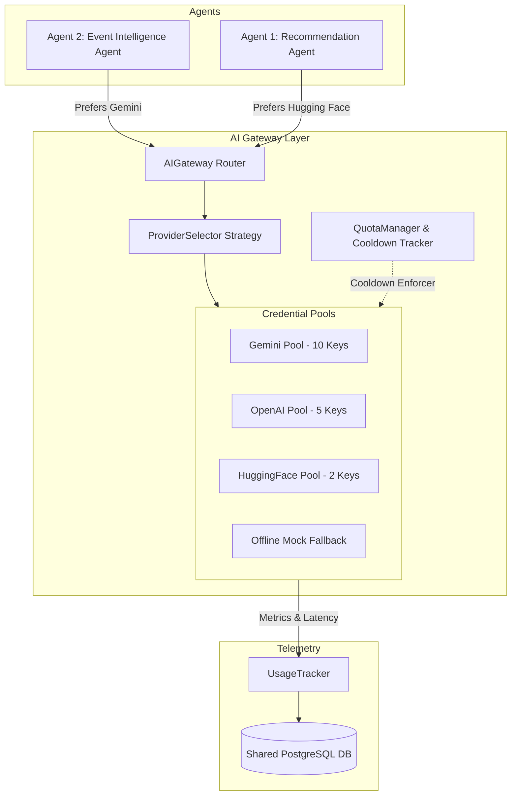

# 🤖 AI Gateway & Provider Pool Architecture

This document describes the design, pool routing, quota management, fallback strategy, and caching behavior of the **AI Gateway Layer** in the AllCollegeEvent (HackGURU) Backend.

---

## 🏗️ Architecture Overview

The **AI Gateway** isolates raw API credentials from business agents (`Agent 1` and `Agent 2`). It manages multi-credential pools (`GeminiPool`, `OpenAIPool`, `HuggingFacePool`), tracks credential health (`AVAILABLE`, `COOLDOWN`, `DISABLED`, `FAILED`), handles rate limits without quota evasion, and enriches usage telemetry.

---

## 🔑 Credential Pools

The Gateway manages three independent credential pools configured via environment variables:

| Pool | Credential Variables | Size | Preferred For | Default Model |
| :--- | :--- | :---: | :--- | :--- |
| **Gemini Pool** | `GEMINI_API_KEY_1` .. `10` | 10 Keys | Agent 2 (Event Intelligence) | `gemini-2.5-flash` |
| **OpenAI Pool** | `OPENAI_API_KEY_1` .. `5` | 5 Keys | Fallback for Agent 2 & Agent 1 | `gpt-4o-mini` |
| **HuggingFace Pool** | `HF_API_KEY_1` .. `2` | 2 Keys | Agent 1 (Recommendation Refinement) | `Qwen/Qwen2.5-Coder-32B-Instruct` |
| **Mock Fallback** | `ENABLE_MOCK_AI_FALLBACK=true` | Offline | Full System Failover | `mock-model` |

---

## 🔄 Agent Routing & Fallback Flow

### **Agent 2 (Event Intelligence Agent)**
1. **Deduplication**: Checks SHA-256 content-hash of event. If hash matches existing intelligence, returns cached result with **0 LLM calls**.
2. **Provider Preference**: `Gemini Pool` → `OpenAI Pool` → `HuggingFace Pool` → `Offline Mock Fallback`.
3. **Output**: Structured JSON containing `domains`, `skills`, `targetAudience`, `difficulty`, `careerPaths`, `prerequisites`, `learningOutcomes`, `eventType`.

### **Agent 1 (Opportunity Recommendation Agent)**
1. **Deterministic Filter**: PostgreSQL database reduces event catalog to candidates. Deterministic Ranking Engine scores top events.
2. **Provider Preference**: `HuggingFace Pool` → `Gemini Pool` → `OpenAI Pool` → `Offline Mock Fallback`.
3. **Output**: Structured JSON containing `eventId`, `reason`, `explanation`, `action`.

---

## ⏳ Quota & Rate Limit Cooldown Policy

The Gateway **respects provider rate limits and terms of service**:

1. **Detection**: `QuotaManager` parses HTTP `429` errors and `retry-after` metadata (e.g. `Please retry in 15s`).
2. **Cooldown**: The specific credential (e.g., `GEMINI_API_KEY_3`) is placed into `COOLDOWN` state for the exact duration specified by the provider (or default 60s).
3. **Load Balancing**: The Gateway switches to another `AVAILABLE` credential in the pool or the next provider tier.
4. **Expiry**: When the cooldown timer elapses, the credential status resets to `AVAILABLE`.

---

## 🛡️ Security & Telemetry Isolation

- **Secret Protection**: API secrets are never logged, printed in stdout, returned over HTTP APIs, or exposed to clients.
- **Safe Identifiers**: Telemetry logs record safe identifiers (`GEMINI_API_KEY_1`, `OPENAI_API_KEY_2`, `HF_API_KEY_1`).
- **Telemetry Records**: Each request records latency, provider, model, tokens, cache hit/miss status, and fallback indicators.
